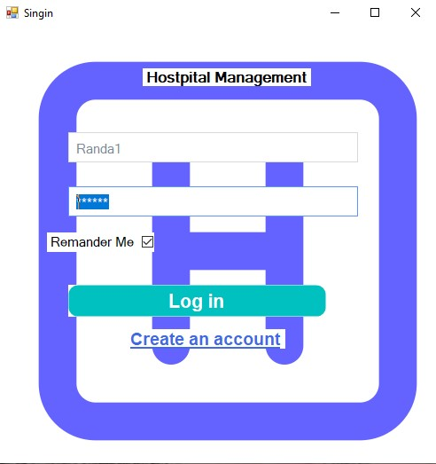
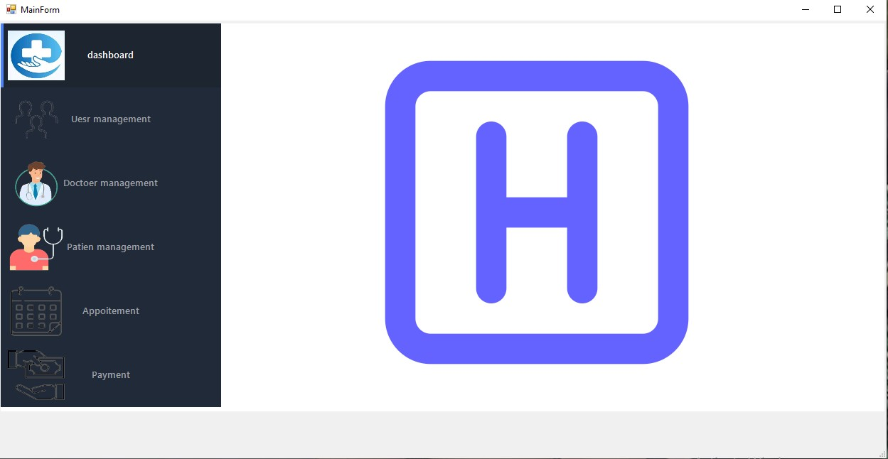
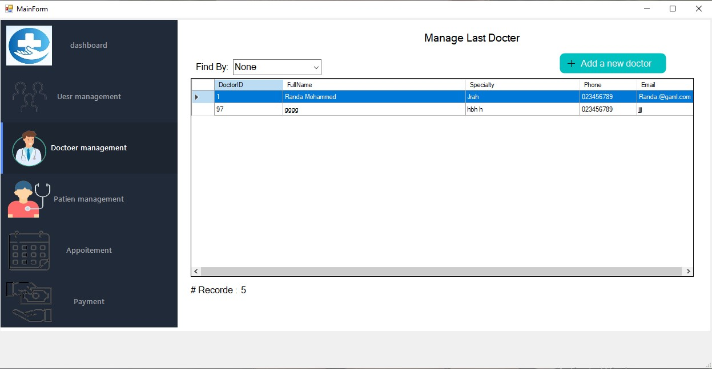

# 🏥 Smart Appointment Desktop System

---

### 📌 Project Screenshot

---

## 📖 Overview

Smart Appointment is a desktop application designed to help clinics and hospitals manage patients, doctors, and appointment schedules easily.

The system provides a simple and organized workflow using a familiar Windows interface.

This project is still under development, and new features such as appointment scheduling and payment management are currently being added.

---

## ✨ Core Features (Current)

✔️ User authentication and basic role management  
✔️ Manage doctors and their specialization  
✔️ Manage patient records  
✔️ Store and retrieve data using SQL Server  
✔️ Layered project structure for clean architecture  

---

## 🚧 Upcoming Features (Work in Progress)

⏳ Add appointment scheduling system  
⏳ Add payments and billing module  
🔜 UI improvements and error validation  

---

## 🛠️ Technologies Used

| Technology | Purpose |
|-----------|---------|
| C# WinForms | User Interface |
| ADO.NET | Data Access |
| SQL Server | Database |
| Layered Architecture | Maintainability & clean project structure |

---

## 🧱 Project Structure

📦 SmartAppointment
┣ 📂 Presentation Layer (WinForms)
┣ 📂 Business Logic Layer
┣ 📂 Data Access Layer (ADO.NET)
┗ 📂 SQL Database

---

## 🚀 How to Run the Project

1. Clone the repository  
2. Restore SQL database (included in `/Database/`)  
3. Open the solution in Visual Studio  
4. Update the connection string if needed  
5. Run & enjoy 🎉  

---

### 📷 Additional Screenshots

  

---

## 📌 Contribution

The project is open for improvements and collaboration.

If you have suggestions or ideas, feel free to open an **Issue** or submit a **Pull Request**.

---

⭐ If you find this project helpful, don’t forget to give it a **Star** ⭐
